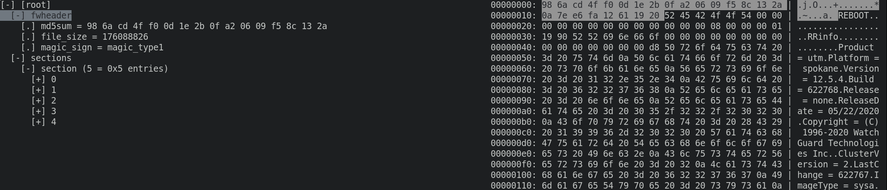

# Watchguard Fireware web update (Sysa-dl) file format

+ watchguard_sysa_dl.ksy contains [Kaitai](https://kaitai.io/) description of Watchguard Fireware web update file format.
+ demo.py demo example shows how we can parse this file format using Kaitai framework.
```
./demo.py M440.sysa-dl /tmp/hdd.ext2 #will extract firmware hdd ext2 file
```
+ fw_web_up.py - file generated by ksc (kaitai-struct-compiler).


Also you can explore Sysa-dl by ksv ( kaitai struct visualizer)

```
ksv M440.sysa-dl watchguard_sysa_dl.ksy
```



